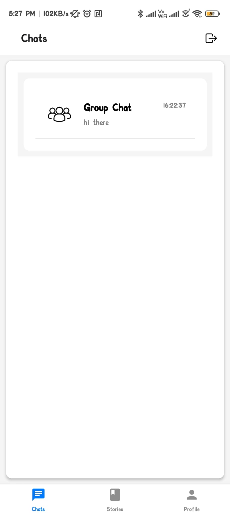

# SecureChat
#### A secure chat application using EAS encryption algorithm and Supabase.

## Features

- Secure chat using EAS encryption algorithm.
- User authentication using Supabase (Anonymous or Github OAuth).
- Real-time chat using Supabase Realtime subscription.
- Chat history stored in Supabase database.

## Installation

1. Clone the repository.
2. Install the dependencies using `npm install`.
3. Start the development server using `npx expo start`.
4. Scan the QR code using Expo Go app on your phone.

## Screenshots

